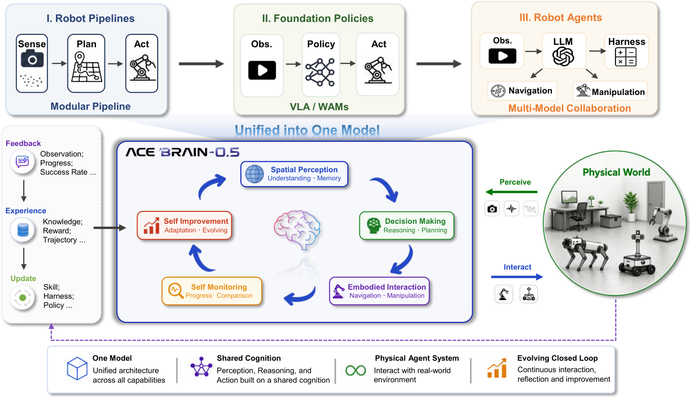
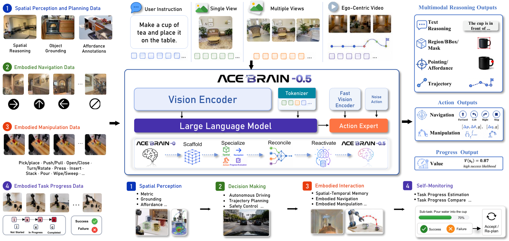

<div align="center">


<br>

# ACE-Brain-0.5: A Unified Embodied Foundational Model for Physical Agentic AI

<p align="center">
  <a href="https://arxiv.org/pdf/2607.04426"></a>
  <a href="https://github.com/ACE-Brain-Team/ACE-Brain-0.5"></a>
  <a href="https://huggingface.co/ACE-Brain/ACE-Brain-0.5-8B"></a>
</p>

</div>

<p align="center">
  
</p>

## 📑 Contents

- [News](#news)
- [Introduction](#introduction)
- [Key Features](#key-features)
- [Method & Architecture](#method-architecture)
- [Capability Evaluation](#capability-evaluation)
- [Citation](#citation)
- [Star History](#star-history)

---

<a id="news"></a>
## 🚀 News

- `2026/07/06`: 🔥 We release our [technical report](https://arxiv.org/abs/2607.04426) and [ckpt](https://huggingface.co/ACE-Brain/ACE-Brain-0.5-8B).

<a id="introduction"></a>
## 🧠 Introduction

**ACE-Brain-0.5** is a unified embodied foundation model for Physical Agentic AI. It extends ACE-Brain-0 from an understanding-centric spatial model into a closed-loop embodied model that can perceive the physical world, plan under goals, act through robot bodies, monitor execution progress, and improve from accumulated experience.

ACE-Brain-0.5 organizes robot intelligence into five tightly coupled cognitive functions: **Spatial Perception**, **Decision Making**, **Embodied Interaction**, **Self Monitoring**, and **Self Improvement**. A single 8B backbone instantiates the core perception-planning-action-evaluation loop, supporting object and affordance grounding, 3D and egocentric spatial reasoning, long-horizon task planning, navigation and manipulation action generation, and progress estimation for verification and recovery.

<a id="key-features"></a>
## 🔥 Key Features

- **Unified Embodied Foundation Model**: Organizes robot intelligence into a single closed-loop model spanning Spatial Perception, Decision Making, Embodied Interaction, Self Monitoring, and Self Improvement.
- **SSR+ training paradigm**: Extends Scaffold-Specialize-Reconcile with a Reactivate stage, combining task-vector merging with targeted fine-tuning to unify spatial reasoning, grounding, navigation, manipulation, and progress estimation without cross-task interference.

<a id="method-architecture"></a>
## 🏗️ Method & Architecture

ACE-Brain-0.5 uses a shared embodied backbone to encode heterogeneous inputs and maintain a unified scene-and-task representation, while dedicated interfaces decode this shared state into spatial grounding, executable subgoal planning, navigation and manipulation actions, and progress-estimation signals. Training follows **SSR+**, which inherits the spatial scaffold from ACE-Brain-0, specializes domain capabilities, reconciles task vectors through model merging, and applies a lightweight Reactivate stage to align output conventions across grounding, navigation, manipulation, and progress estimation.

<p align="center">
  
</p>

<a id="capability-evaluation"></a>
## 📊 Capability Evaluation

ACE-Brain-0.5 is evaluated as a unified embodied foundation model rather than as a collection of task-specific specialists. The goal is to verify whether a single model can preserve broad spatial understanding while extending to planning, action generation, execution monitoring, and self-improvement.

| Capability | Summary |
|------------|-----------|
| **Spatial Perception** | Preserves strong spatial reasoning while extending to embodied grounding and affordance understanding. |
| **Decision Making** | Evaluates planning and decision reasoning under embodied and driving scenarios. |
| **Embodied Interaction** | Supports executable navigation decisions and continuous manipulation control. |
| **Self Monitoring** | Estimates task progress for execution assessment and recovery. |
| **Self Improvement** | Uses rollout feedback to improve behavior beyond static imitation. |

Overall, the results indicate that ACE-Brain-0.5 is a step toward a general embodied brain: it trades narrow task specialization for unified coverage across perception, planning, action, evaluation, and adaptation.

<a id="citation"></a>
## 📖 Citation

If you find ACE-Brain-0.5 useful for your research and applications, please consider citing our technical report.

```bibtex
@misc{brainteam2026acebrain05unifiedembodiedfoundational,
      title={ACE-Brain-0.5: A Unified Embodied Foundational Model for Physical Agentic AI},
      author={Brain Team and Ziyang Gong and Haoming Gu and Zehang Luo and Tianyi Zhang and Tao Tao and Yixiao Chi and Zhe Liu and Lingsi Zhu and Jingyuan Liu and Anke Tang and Songze Li and Yilun Kong and Ningjing Liu and Tianyu Zhu and Yunpeng Qing and Shuang Luo and Xiang Liu and Shi Fu and Dawei Nie and Sixiang Liu and Zhexi Wen and Feng Pan and Xiaofeng Wang and Zhi Hou and Chunxiao Liu and Xue Yang and Junchi Yan and Hengshuang Zhao and Dacheng Tao and Xiaogang Wang},
      year={2026},
      eprint={2607.04426},
      archivePrefix={arXiv},
      primaryClass={cs.RO},
      url={https://arxiv.org/abs/2607.04426},
}
```

<a id="star-history"></a>
## ⭐ Star History

[](https://www.star-history.com/#ACE-Brain-Team/ACE-Brain-0.5&type=date&legend=top-left)
